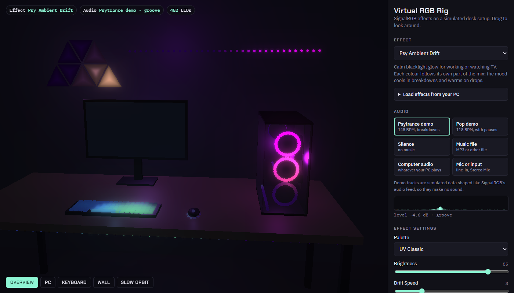

# Virtual RGB Rig

Preview [SignalRGB](https://signalrgb.com) effects on a 3D desk setup in your browser. You don't need any RGB hardware, and you don't need to install anything.

**Open it:** https://akostkasmith.github.io/signalrgb-effects/



## What you can do with it

- **See an effect on a full setup:** a glass-panel PC (front, rear and CPU cooler fan rings, RAM, GPU and case strips), a per-key keyboard, a mouse, monitor backlighting, wall and under-desk strips and eight Nanoleaf-style triangle panels. That's 452 lights, which spill colour onto the desk and wall.
- **Try the effects you already have:** load SignalRGB's library effects or your own straight from your PC (see below).
- **Drive it with real music:** use whatever your computer is playing, an audio file, a microphone or line-in, or the built-in demo tracks.
- **Adjust settings live:** every effect's own sliders, colours and switches appear in the side panel, as they do in SignalRGB.
- **Record a clip:** save a WebM video of the 3D view (with sound when you use real audio) to share on Discord or anywhere else.
- **Look around:** drag to orbit, or use the Overview, PC, Keyboard and Wall cameras and a slow orbit.

## Preview the effects you already have

Open **Load effects from your PC** under the effect picker and choose a folder. Paste one of these paths into the folder dialog's address bar:

| Folder | What's in it |
| --- | --- |
| `%LOCALAPPDATA%\WhirlwindFX\SignalRgb\cache\effects` | Library effects SignalRGB has downloaded for you |
| `%USERPROFILE%\Documents\WhirlwindFX\Effects` | Your own and sideloaded effects |

The effects appear under "From your PC" in the list. They are read in your browser only: nothing is uploaded, and none of them are part of this repo.

Effects built on screen capture, game integrations or hardware sensors load, but they have nothing to react to here, so they look static or dark.

## Audio sources

| Source | What it uses |
| --- | --- |
| Psytrance demo, Pop demo | Simulated tracks with breakdowns, drops and pauses. They make no sound |
| Music file | An MP3 or other audio file from your computer |
| Computer audio | Whatever your PC is playing (Spotify, YouTube, games), like SignalRGB itself. In the share dialog, choose *Entire screen* and switch on *Share system audio*. Chrome and Edge on Windows; only the sound is used |
| Mic or input | A microphone, line-in, or a "Stereo Mix" or virtual-cable device |

Every source is converted to the audio data SignalRGB gives effects, matched to measurements from a real install.

## How it works

SignalRGB runs each effect as a small web page that draws on a 320 × 200 canvas, then colours each of your devices' LEDs from where that device sits on the canvas. The rig does the same:

1. The effect loads unmodified into a hidden 320 × 200 frame.
2. The page gives it what SignalRGB would: an `engine.audio` object, its settings as global variables, and calls to its `on<setting>Changed()` and `onEngineReady()` hooks.
3. Every frame, each virtual LED samples its own spot on the effect's canvas. Tick **Show where each device samples the canvas** to see the layout.

It's a single `index.html` using [three.js](https://threejs.org) for the 3D scene.

## Run it locally

Serve the folder with any static file server; opening `index.html` straight from disk won't load effects. For example:

```bash
npx serve .
```

To add an effect to the built-in list, copy its `.html` into `effects/` and add it to the `EFFECTS` list near the top of the script in `index.html`.

## Notes for effect authors

Measured on a real SignalRGB install, where it differs from the official docs:

- `engine.audio.freq` is an `ArrayBuffer` of 200 **unsigned** bytes. Read it with `new Uint8Array(engine.audio.freq)`; the docs' `Int8Array` turns loud values negative. Typical music averages about 5, with the bass bins around 40. In silence every byte is 0.
- `engine.audio.level` stays between about -8 and 0 dB while music plays and drops to `-Infinity` in silence. It works as a silence detector but not as a loudness meter.
- Effects run in Ultralight (WebKit), not Chromium. Canvas `shadowBlur` is very slow there; use layered fills or radial gradients for glows.
- Each `<meta property>` becomes a global variable, so don't give a function or variable the same name as a setting.
- SignalRGB calls `on<setting>Changed()` when a setting changes and `onEngineReady()` once the engine is up. Many library effects work out colours inside those hooks, or only start drawing from `onEngineReady()`.

## Included effect: Psy Ambient Drift


A calm, audio-reactive blacklight glow for working or watching TV, and the rig's default effect. Each colour follows its own part of the mix, the glows breathe with the bass, kicks send soft ripples, and the mood cools in breakdowns and warms on drops. It never flashes.

**Install:** download [`PsyAmbientDrift.html`](effects/PsyAmbientDrift.html) and [`PsyAmbientDrift.png`](effects/PsyAmbientDrift.png) (the thumbnail, which must keep the same name), put both in `Documents\WhirlwindFX\Effects`, and restart SignalRGB.

<details>
<summary>Settings</summary>

| Setting | Range | Default | What it does |
| --- | --- | --- | --- |
| Palette | UV Classic, Goa Neon, Toxic Forest, Acid Pop | UV Classic | Colour scheme |
| Brightness | 10–100 | 85 | Overall brightness |
| Drift Speed | 1–10 | 3 | How fast the glows wander |
| Music Reactivity | 0–10 | 6 | How strongly the music drives the glow. 0 is pure ambient |
| Kick Ripples | 0–10 | 4 | Strength of the ripple on each kick |
| Fireflies on Hi-hats | 0–10 | 3 | How often fireflies appear |
| Audio Sensitivity | 1–10 | 5 | Raise it for quiet music or a low system volume |
| Journey Mood | on/off | on | Cooler breakdowns, warmer drops |

</details>

## License

[MIT](LICENSE)
