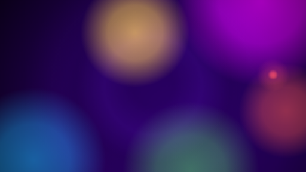

# SignalRGB Effects

Audio-reactive lighting effects for [SignalRGB](https://signalrgb.com), plus **Virtual RGB Rig**, a browser-based 3D desk setup for previewing effects without owning the hardware.

**Try the simulator:** https://akostkasmith.github.io/signalrgb-effects/



## Psy Ambient Drift

A calm blacklight ambience for working or watching TV. Slow fluorescent lava-lamp glows drift across your devices and follow the music without ever flashing:

- **Each colour listens to its own part of the mix:** sub kick, bass, low mids, acid/high mids and hi-hats.
- **Bass breathing:** every glow swells gently with the rolling bassline.
- **Kick ripples:** soft, wide UV rings drift outward on each kick.
- **Fireflies:** hi-hats now and then spawn a mote that fades in and out over a few seconds.
- **Journey mood:** breakdowns go cooler and dimmer, drops warmer and fuller, blended over a few seconds.
- **Works without music:** after a few seconds of silence it settles into a plain ambient drift.

Tuned on psytrance, but it works with any music.

### Install

1. Download [`PsyAmbientDrift.html`](effects/PsyAmbientDrift.html) and [`PsyAmbientDrift.png`](effects/PsyAmbientDrift.png). The PNG is the thumbnail and must keep the same name.
2. Put both in `Documents\WhirlwindFX\Effects`.
3. Restart SignalRGB and pick **Psy Ambient Drift** from your effects.

### Settings

| Setting | Range | Default | What it does |
| --- | --- | --- | --- |
| Palette | UV Classic, Goa Neon, Toxic Forest, Acid Pop | UV Classic | Colour scheme |
| Brightness | 10–100 | 85 | Overall brightness |
| Drift Speed | 1–10 | 3 | How fast the glows wander |
| Music Reactivity | 0–10 | 6 | How strongly the music drives the glow. 0 is pure ambient |
| Kick Ripples | 0–10 | 4 | Strength of the ripple on each kick |
| Fireflies on Hi-hats | 0–10 | 3 | How often fireflies appear |
| Audio Sensitivity | 1–10 | 5 | Raise it for quiet music or a low system volume |
| Journey Mood | on/off | on | Cooler breakdowns, warmer drops |

## Virtual RGB Rig

[`index.html`](index.html) is a 3D desk with a glass-panel PC (front, rear and cooler fan rings, RAM, GPU and case strips), a per-key keyboard, a mouse, monitor backlighting, wall and under-desk strips and eight Nanoleaf-style triangle panels.

It runs effects the way SignalRGB does. Each effect loads unmodified into a 320 × 200 canvas, and every virtual LED samples its own spot on that canvas. Audio comes from built-in demo tracks or from a music file of your own, converted to the same data format SignalRGB hands effects. You can record a WebM clip of the view to share.

To run it locally, serve the folder with any static file server (opening `index.html` directly from disk will not load the effect), for example:

```bash
npx serve .
```

To preview another effect, copy its `.html` into `effects/` and add it to the `EFFECTS` list near the top of the script in `index.html`.

## Notes for effect authors

Measured on a real SignalRGB install, which differs from the official docs:

- `engine.audio.freq` is an `ArrayBuffer` of 200 **unsigned** bytes. Read it with `new Uint8Array(engine.audio.freq)`; the docs' `Int8Array` turns loud values negative. Typical music averages about 5, with the bass bins around 40. In silence every byte is 0.
- `engine.audio.level` stays between about -8 and 0 dB while music plays and drops to `-Infinity` in silence. It works as a silence detector but not as a loudness meter.
- Effects run in Ultralight (WebKit), not Chromium. Canvas `shadowBlur` is very slow there; use layered fills or radial gradients for glows.
- Each `<meta property>` becomes a global variable, so don't give a function or variable the same name as a setting.

## License

[MIT](LICENSE)
